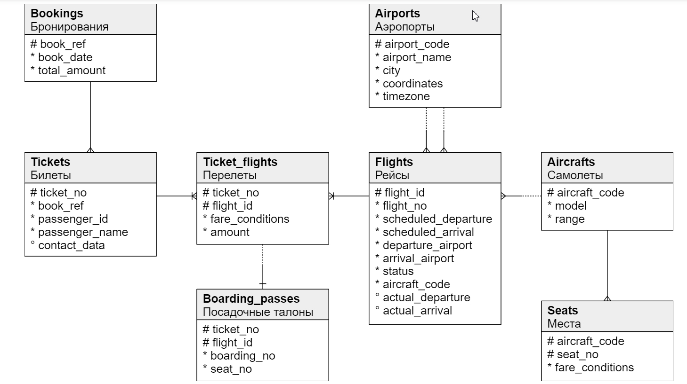
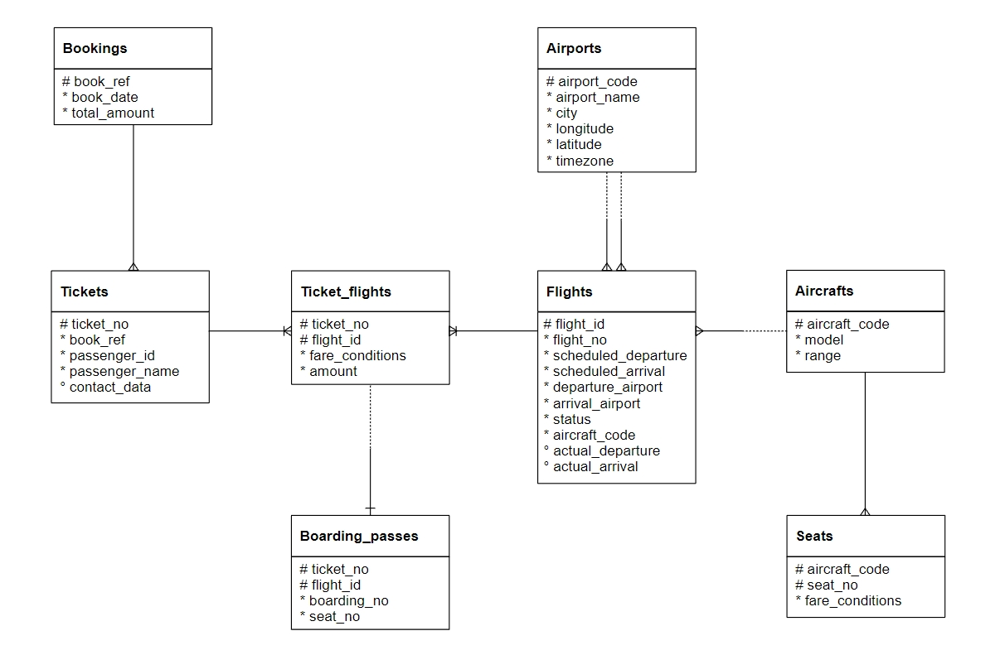

Описание схемы
Основной сущностью является бронирование (bookings).

В одно бронирование можно включить несколько пассажиров, каждому из которых выписывается отдельный билет (tickets). Билет имеет уникальный номер и содержит информацию о пассажире. Как таковой пассажир не является отдельной сущностью. Как имя, так и номер документа пассажира могут меняться с течением времени, так что невозможно однозначно найти все билеты одного человека; для простоты можно считать, что все пассажиры уникальны.

Билет включает один или несколько перелетов (ticket_flights). Несколько перелетов могут включаться в билет в случаях, когда нет прямого рейса, соединяющего пункты отправления и назначения (полет с пересадками), либо когда билет взят «туда и обратно». В схеме данных нет жёсткого ограничения, но предполагается, что все билеты в одном бронировании имеют одинаковый набор перелетов.

Каждый рейс (flights) следует из одного аэропорта (airports) в другой. Рейсы с одним номером имеют одинаковые пункты вылета и назначения, но будут отличаться датой отправления.

При регистрации на рейс пассажиру выдаётся посадочный талон (boarding_passes), в котором указано место в самолете. Пассажир может зарегистрироваться только на тот рейс, который есть у него в билете. Комбинация рейса и места в самолете должна быть уникальной, чтобы не допустить выдачу двух посадочных талонов на одно место.

Количество мест (seats) в самолете и их распределение по классам обслуживания зависит от модели самолета (aircrafts), выполняющего рейс. Предполагается, что каждая модель самолета имеет только одну компоновку салона. Схема данных не контролирует, что места в посадочных талонах соответствуют имеющимся в самолете (такая проверка может быть сделана с использованием табличных триггеров или в приложении).

The main entity is a booking (bookings).

One booking can include several passengers, with a separate ticket (tickets) issued to each passenger. A ticket has a unique number and includes information about the passenger. As such, the passenger is not a separate entity. Both the passenger's name and identity document number can change over time, so it is impossible to uniquely identify all the tickets of a particular person; for simplicity, we can assume that all passengers are unique.

The ticket includes one or more flight segments (ticket_flights). Several flight segments can be included into a single ticket if there are no non-stop flights between the points of departure and destination (connecting flights), or if it is a round-trip ticket. Although there is no constraint in the schema, it is assumed that all tickets in the booking have the same flight segments.

Each flight (flights) goes from one airport (airports) to another. Flights with the same flight number have the same points of departure and destination, but differ in departure date.

At flight check-in, the passenger is issued a boarding pass (boarding_passes), where the seat number is specified. The passenger can check in for the flight only if this flight is included into the ticket. The flight-seat combination must be unique to avoid issuing two boarding passes for the same seat.

The number of seats (seats) in the aircraft and their distribution between different travel classes depends on the model of the aircraft (aircrafts) performing the flight. It is assumed that every aircraft model has only one cabin configuration. Database schema does not check that seat numbers in boarding passes have the corresponding seats in the aircraft (such verification can be done using table triggers, or at the application level).

